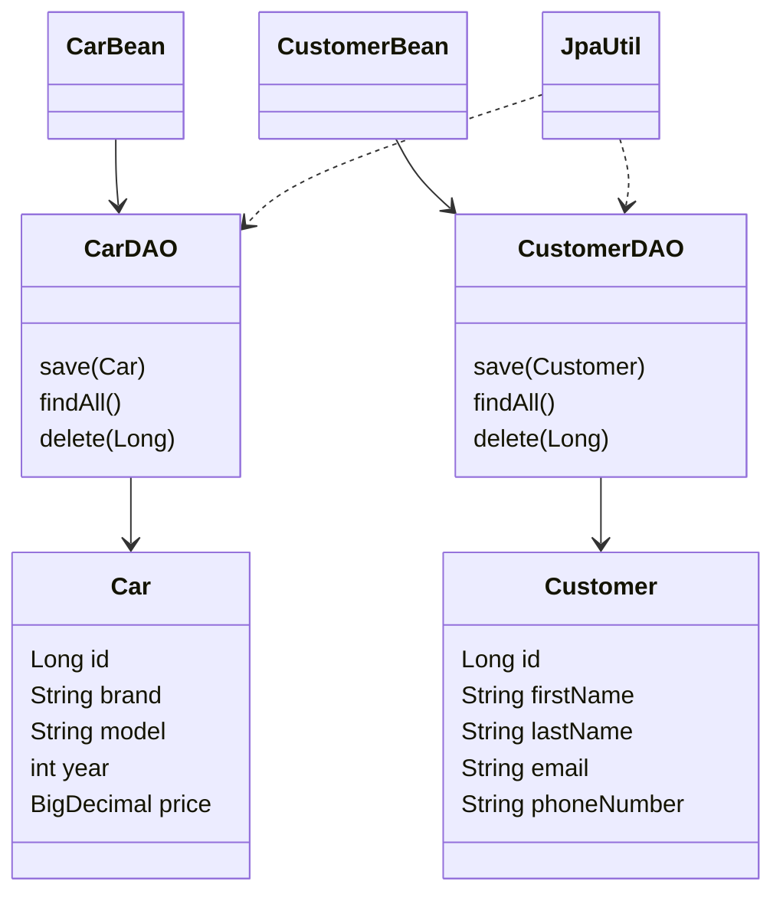

# Car Dealership Management System

## Abstract

The Car Dealership Management System is a JSF and Hibernate web application for maintaining a dealership's car inventory and customer directory. It provides create, read, update, and delete operations for the `Car` and `Customer` entities through browser forms.

## Problem Statement

Dealership records are often kept in spreadsheets or paper files, making it difficult to avoid duplicates, find current information, and keep updates consistent. The system provides one validated interface for managing the core records.

## Scope

The first phase covers car and customer registration, listing, editing, deletion, input validation, and PostgreSQL persistence. Authentication, sales contracts, payments, reporting, and deployment to a public server are outside this phase.

## AS-IS Model

1. Staff record car and customer information manually or in separate files.
2. Searching and updating records is slow.
3. Invalid values and duplicate customer emails may be entered.
4. There is no single workflow for maintaining both record types.

## TO-BE Model

1. Staff open the JSF web application in a browser.
2. Staff submit validated car or customer forms.
3. Hibernate persists changes to PostgreSQL.
4. Staff can list, edit, and delete current records from the same interface.

## Business Requirements

- The system shall create, list, update, and delete cars.
- The system shall create, list, update, and delete customers.
- Car brand, model, year, and price shall be validated.
- Customer name and email shall be validated; email shall be unique.
- The system shall persist data in PostgreSQL through Hibernate/JPA.
- The interface shall provide external, internal, and inline CSS examples.

## Software Qualities

- Usability: simple forms, field-level messages, and navigation between modules.
- Reliability: transaction rollback and entity constraints protect persistence operations.
- Maintainability: model, DAO, bean, and view responsibilities are separated.
- Security: server-side validation remains authoritative; database credentials should be supplied through deployment configuration before production use.
- Performance: list queries load only the records needed by each page.
- Portability: Maven builds a standard WAR for a Java web container.
- Testability: persistence access is isolated in DAO classes.

## Initial Class Diagram



## Validation and CSS Evidence

- JSF validation: required fields, `f:validateLongRange` for car year, and `f:validateRegex` for customer email.
- Bean validation: `@NotBlank`, `@Email`, `@Pattern`, `@Min`, `@Max`, and `@DecimalMin` on entities.
- Client-side validation: JavaScript checks the car year and customer email before submit.
- External CSS: `src/main/webapp/resources/css/style.css`.
- Internal CSS: the `<style>` block in each XHTML page.
- Inline CSS: the heading style in each XHTML page.

## Links Required For Submission

- GitHub source link: **REPLACE WITH PUBLIC GITHUB URL**
- Google Meet/Google Vids recording link: **REPLACE WITH 5-10 MINUTE VIDEO URL**

## Running In VS Code

### Prerequisites

- JDK 8 or later, with `JAVA_HOME` configured.
- Maven 3.8 or later.
- PostgreSQL running locally.
- Apache Tomcat 9 (Servlet 4 compatible).

### Database

Create the database before first launch:

```sql
CREATE DATABASE car_dealership;
```

Update the username and password in `src/main/resources/META-INF/persistence.xml` if your PostgreSQL credentials differ. Hibernate is configured with `hbm2ddl.auto=update`, so it creates or updates the `cars` and `customers` tables.

### Build and deploy

Run in the VS Code terminal from the project root:

```bash
mvn clean package
```

Copy `target/ProductManager-1.0-SNAPSHOT.war` into Tomcat's `webapps` directory, start Tomcat, then open:

- `http://localhost:8080/ProductManager-1.0-SNAPSHOT/cars.xhtml`
- `http://localhost:8080/ProductManager-1.0-SNAPSHOT/customers.xhtml`

In VS Code, the Extension Pack for Java is useful for editing and Maven support. A Tomcat extension can start and deploy the generated WAR, or Tomcat can be started with its `bin/startup.sh` script.

## Submission Archive

Rename the final archive using the requested format, for example:

`23000_first_name_last_name_assignment_3.zip`

Include this documentation, the project source, the generated WAR or a zipped project copy, and the completed public GitHub and video links.
