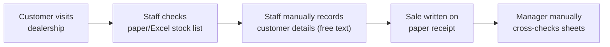
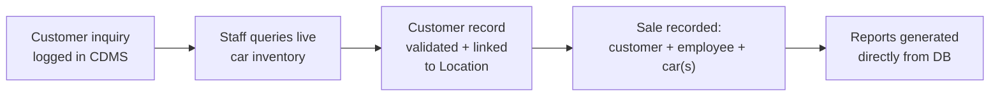
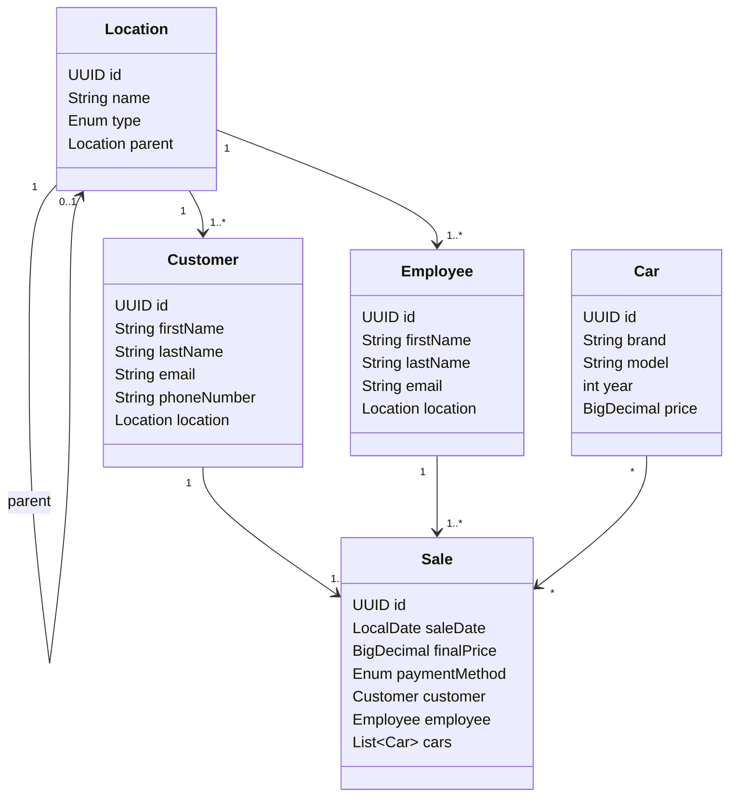

# Car Dealership Management System

## Abstract

The Car Dealership Management System (CDMS) is a web-based platform for managing the core operations of a car dealership: vehicle inventory, customer records, employee records, and sales transactions. It also models Rwanda's full administrative location hierarchy (Province → District → Sector → Cell → Village).

## Problem Statement

Small and mid-sized dealerships in Rwanda typically track inventory, customers, and sales using spreadsheets or paper records. This leads to duplicate customer entries, no single source of truth for stock levels, inconsistent location data, and no reliable way to trace which employee closed which sale.

## Scope

**In scope:** car inventory CRUD, customer/employee records linked to a location hierarchy, sales linking a customer + employee + one or more cars, validation at UI/business-logic/database level.

**Out of scope:** payment gateway integration, inventory forecasting, multi-dealership management.

## AS-IS Model



## TO-BE Model



## Business Requirements

- BR1: The system shall create, list, update, and delete cars.
- BR2: The system shall create, list, update, and delete customers, each linked to a location.
- BR3: The system shall create, list, update, and delete employees, each linked to a location.
- BR4: The system shall record a sale linking one customer, one employee, and one or more cars.
- BR5: Car brand/model/year/price and customer name/email shall be validated; email shall be unique.
- BR6: The system shall persist data in PostgreSQL through Hibernate/JPA.
- BR7: The system shall filter customers/employees by location or province.
- BR8: The interface shall demonstrate external, internal, and inline CSS.

## Software Qualities

- **Usability** — simple forms, field-level messages
- **Reliability** — transaction rollback, entity constraints
- **Maintainability** — model / DAO / bean / view separation
- **Security** — server-side validation authoritative; credentials never committed
- **Performance** — list queries load only what each page needs
- **Portability** — Maven WAR for any Servlet 4-compatible container
- **Testability** — persistence isolated in DAO classes

## Initial Class Diagram



## Validation and CSS Evidence

- JSF validation: `required`, `f:validateLongRange` (car year), `f:validateRegex` (customer email)
- Bean Validation: `@NotBlank`, `@Email`, `@Pattern`, `@Min`, `@Max`, `@DecimalMin` on entities
- Client-side JS: validates car year and customer phone before submit
- External CSS: `src/main/webapp/resources/css/styles.css`
- Internal CSS: `<style>` block in each XHTML page
- Inline CSS: heading `style` attribute in each XHTML page

## Practical Implementation

Entities chosen for full CRUD via JSF + Hibernate: **Car** and **Customer**.

## Links Required For Submission

- GitHub source: https://github.com/mukunzijonathan/car-dealership
- Video walkthrough: **REPLACE WITH VIDEO URL**

## Running Locally

**Prerequisites:** JDK 8+, Maven 3.8+, PostgreSQL, Apache Tomcat/TomEE 9 (Servlet 4).

```sql
CREATE DATABASE car_dealership;
```

Copy `src/main/resources/META-INF/persistence.xml.example` → `persistence.xml`, fill in your local credentials (this file is gitignored — never commit real credentials).

```bash
mvn clean package
```