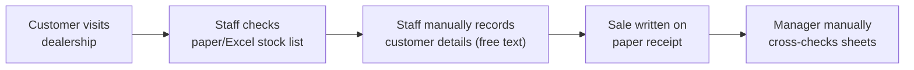
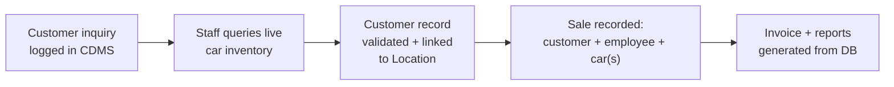
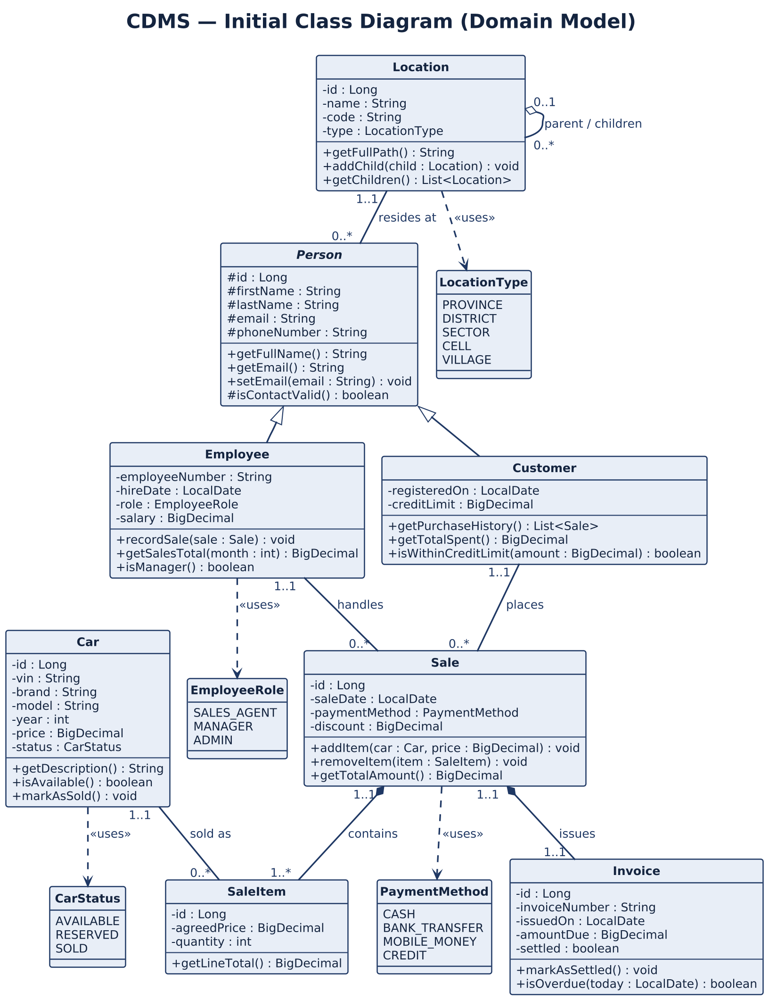
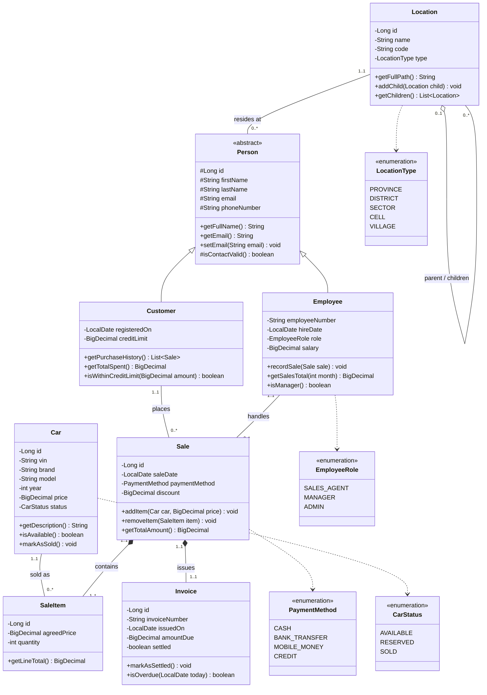

# Car Dealership Management System (CDMS)

WebTech — Assignment 3 (Phase 1) · MUKUNZI Jonathan — 27132

- **GitHub repository:** `https://github.com/mukunzijonathan/car-dealership`

## Abstract

The Car Dealership Management System (CDMS) is a web-based platform for managing the core operations of a car dealership: vehicle inventory, customer records, employee records, and sales transactions. It also models Rwanda's full administrative location hierarchy (Province → District → Sector → Cell → Village), used to locate customers and employees precisely rather than as free-text addresses.

## Problem Statement

Small and mid-sized dealerships in Rwanda typically track inventory, customers, and sales using spreadsheets or paper records. This leads to duplicate customer entries, no single source of truth for stock levels, inconsistent location data, and no reliable way to trace which employee closed which sale or which cars were part of a multi-vehicle transaction.

## Scope

**In scope:** car inventory CRUD; customer/employee records linked to a location hierarchy; sales linking a customer, an employee and one or more cars; an agreed price per car through sale line items; one invoice per sale; validation at UI, business-logic and database level.

**Out of scope:** payment gateway integration, inventory forecasting, multi-dealership management.

## AS-IS Model



## TO-BE Model



## User Stories

**Sales agent**

- US1: register a new car with brand, model, year and price, so stock is visible in real time.
- US2: update a car's price and status, so a customer is never quoted an out-of-date figure.
- US3: delete a car captured twice, so the stock count stays accurate.
- US4: register a customer with a validated email and phone, so I can contact them later.
- US5: record a sale linking the customer, myself and one or more cars, so it is traceable.

**Sales manager**

- US6: list all sales handled by each employee, to measure monthly performance.
- US7: store customers/employees against a village, cell, sector, district and province, to analyse demand per area.
- US8: raise exactly one invoice per sale, so finance has a single document per transaction.
- US9: see the price agreed for each car in a multi-car sale, so discounts can be audited line by line.

**System administrator**

- US10: maintain the location hierarchy as a tree, so a new village needs no schema change.
- US11: have invalid data rejected at the form, in the entity and at the database.
- US12: restrict status, payment method and role to a fixed list, so no one invents codes.

**Customer**

- US13: have my details captured once and reused on my next visit.

## Business Requirements

- BR1: create, list, update, and delete cars.
- BR2: create, list, update, and delete customers, each linked to a location.
- BR3: create, list, update, and delete employees, each linked to a location.
- BR4: record a sale linking one customer, one employee, and one or more cars.
- BR5: prevent duplicate customers/employees (by email) and duplicate cars (by VIN).
- BR6: validate all input at the UI, business-logic and persistence layers.
- BR7: filter customers/employees by exact location or by province.
- BR8: list cars with pagination and sorting (by price, by year).
- BR9: raise exactly one invoice per sale and store an agreed price per car as a line item.
- BR10: restrict location type, car status, payment method and employee role to enumerated values.

## Software Qualities

- **Usability** — field-level error messages next to the input that failed
- **Maintainability** — model / DAO / managed bean / view separation
- **Reusability** — contact and identity data declared once in `Person`, inherited by subclasses
- **Data integrity** — unique and foreign-key constraints plus Bean Validation on every entity
- **Security** — server-side validation is authoritative; credentials are not committed
- **Scalability** — pagination on listings; the location tree scales to any depth
- **Performance** — queries load only what each page needs
- **Portability** — Maven WAR for any Servlet 4 compatible container
- **Testability** — persistence isolated behind DAO classes

## Initial Class Diagram

Drawn in standard UML notation: three compartments per class (name / attributes / behaviour), a visibility marker on every member (`-` private, `#` protected, `+` public), and a `min..max` multiplicity at **both** ends of every relationship.

The rendered figure used in the documentation is [`docs/class-diagram.png`](docs/class-diagram.png), generated from [`docs/class-diagram.puml`](docs/class-diagram.puml) (PlantUML). The notation key is [`docs/uml-notation-key.png`](docs/uml-notation-key.png). The same model is reproduced below as Mermaid so it renders directly on GitHub.





### Software design principles applied

- **Abstraction** — only domain concepts are classes; managed beans, DAOs and tables are deliberately absent because they belong to the implementation layers.
- **Encapsulation** — attributes are private (`-`), or protected (`#`) where a subclass must reach them; state is reached only through the public operations in the third compartment.
- **Decomposition** — association for independent objects that refer to each other, aggregation (`o--`) for a weak "has-a" where the part outlives the whole, composition (`*--`) for a strong "has-a" where the part dies with the whole.
- **Generalization** — the identity and contact data common to `Customer` and `Employee` is declared once in the abstract `Person` superclass and inherited.

### Relationships

| Relationship | Type | Multiplicity (both ends) |
| --- | --- | --- |
| Person — Location | Association | Location `1..1` — Person `0..*` |
| Location — Location | Aggregation | parent `0..1` — children `0..*` |
| Customer — Sale | Association | Customer `1..1` — Sale `0..*` |
| Employee — Sale | Association | Employee `1..1` — Sale `0..*` |
| Sale — SaleItem | Composition | Sale `1..1` — SaleItem `1..*` |
| Sale — Invoice | Composition | Sale `1..1` — Invoice `1..1` |
| Car — SaleItem | Association | Car `1..1` — SaleItem `0..*` |
| Person ← Customer / Employee | Generalization | n/a |

## Practical Implementation

Entities chosen for full CRUD via JSF + Hibernate: **Car** and **Customer**.

`Customer` is implemented together with its generalization: the shared members sit in an abstract `Person` class annotated `@MappedSuperclass`, and `Customer` extends it, so the inheritance shown in the diagram is real in the code. `Employee`, `Location`, `Sale`, `SaleItem` and `Invoice` are Phase-1 design, scheduled for the next phase.

### Three types of validation

1. **JSF built-in validators** — `required` with a custom `requiredMessage`, `f:validateLongRange` on `Car.year`, `f:validateRegex` on `Customer.email`.
2. **Bean Validation** (JSR-380 on the entities) — `@NotBlank`, `@Email` + unique column, `@Pattern` on the phone, `@Min`/`@Max` on the year, `@DecimalMin` on the price.
3. **Client-side JavaScript** — `validateCarForm()` and `validateCustomerForm()` run on submit for immediate feedback; the server-side checks stay authoritative.

### Three ways of applying CSS

- **External** — `src/main/webapp/resources/css/style.css`, linked with `h:outputStylesheet`.
- **Internal** — a `<style>` block in `h:head` of `cars.xhtml` and `customers.xhtml`.
- **Inline** — a `style` attribute on individual elements, e.g. the heading `style="color:#2c3e50;"`.

## Running Locally

**Prerequisites:** JDK 8+, Maven 3.8+, PostgreSQL, Apache Tomcat/TomEE 9 (Servlet 4).

```sql
CREATE DATABASE car_dealership;
```

Set your own database user and password in `src/main/resources/META-INF/persistence.xml` (it ships with `YOUR_SERVER_NAME` / `YOUR_PASSWORD` placeholders — do not commit real credentials). Hibernate creates the tables on first run via `hibernate.hbm2ddl.auto=update`.

```bash
mvn clean package
```

Deploy `target/ProductManager-1.0-SNAPSHOT.war` to Tomcat and open `/cars.xhtml` or `/customers.xhtml`.
